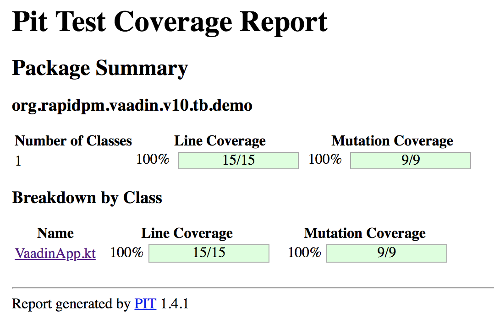

<center>
<a href="https://vaadin.com">
 </a>
</center>


# Nano Vaadin - Ramp up in a second.
A nano project to start a Vaadin project. Perfect for Micro-UIs packed as fat jar in a docker image.

## Supported JDK
This example is running from JDK8 up to JDK13

## target of this project
The target of this project is a minimal rampup time for a first hello world.
Why we need one more HelloWorld? Well, the answer is quite easy. 
If you have to try something out, or you want to make a small POC to present something,
there is no time and budget to create a demo project.
You don´t want to copy paste all small things together.
Here you will get a Nano-Project that will give you all in a second.

Clone the repo and start editing the class ```BasicTestUI``` or ```BasicTestUIRunner```.
Nothing more. 

## How does it work?
This project will not use any additional maven plugin or technology.
Core Kotlin and the Vaadin Dependencies are all that you need to put 
a Vaadin app into a Servlet-container.

Here we are using the plain **meecrowave** as Servlet-Container.
[http://openwebbeans.apache.org/meecrowave/index.html](http://openwebbeans.apache.org/meecrowave/index.html)


As mentioned before, there is not additional technology involved.
No DI to wire all things together. 

But let´s start from the beginning.

## Start the Servlet-Container (Kotlin)
The class ```BasicTestUIRunner``` will ramp up the Container.

Here all the basic stuff is done. The start will init. a ServletContainer at port **8080**.
If you want to use a random port, use ```randomHttpPort()``` instead of ```httpPort = 8080```
The WebApp will deployed as **ROOT.war**. 

```kotlin
object BasicTestUIRunner {

  @JvmStatic
  fun main(args: Array<String>) {
    Meecrowave(object : Meecrowave.Builder() {
      init {
        //        randomHttpPort();
        httpPort = 8080
        isTomcatScanning = true
        isTomcatAutoSetup = false
        isHttp2 = true
      }
    })
        .bake()
        .await()
  }
}
```

After this you can start the app invoking the main-method.

## The UI itself
The UI itself is quite easy. 
There is only a button you can click.
For every click, the counter will be increased.

```kotlin
@Route("")
class VaadinApp : Composite<Div>(), HasLogger {

  private val btnClickMe = Button("click me")
  private val lbClickCount = Span("0")
  private val layout = VerticalLayout(btnClickMe, lbClickCount)

  private var clickcount = 0

  init {
    btnClickMe.setId(BTN_CLICK_ME)
    btnClickMe.addClickListener { event -> lbClickCount.text = (++clickcount).toString() }

    lbClickCount.setId(LB_CLICK_COUNT)

    //set the main Component
    logger().info("setting now the main ui content..")
    content.add(layout)
  }

  companion object {
    // read http://vaadin.com/testing for more infos
    val BTN_CLICK_ME = buttonID().apply(VaadinApp::class.java, "btn-click-me")
    val LB_CLICK_COUNT = spanID().apply(VaadinApp::class.java, "lb-click-count")
  }
}
```


## Kotlin, Vaadin and TDD

For UI Tests I am using Selenoid. You will find this on github at []()

After the selenoid node is (locally) started you could check the status 
at [http://localhost:4444/status](http://localhost:4444/status).

Default location for videos when installed with cm is ~/.aerokube/selenoid/video or C:\Users\<user>\.aerokube\selenoid\video.


For testing the Vaadin app, the Open Source project Testbench-NG is used.
This is a jUnit5 / Webdriver - manager AddOn for the Selenium and Testbench projects.
To read more about it, plase have a look at 

[https://github.com/vaadin-developer/vaadin-testbench-ng](https://github.com/vaadin-developer/vaadin-testbench-ng)
The lates version of Testbench NG is : 

[](https://maven-badges.herokuapp.com/maven-central/org.rapidpm/rapidpm-vaadin-testbench-ng)
 

The next step is to create a PageObject for the UI.
This can be done straight forward.

```kotlin
class BasicTestPageObject(webDriver: WebDriver, containerInfo: ContainerInfo)
  : AbstractVaadinPageObject(webDriver, containerInfo) {

  fun button(): ButtonElement {
    return btn().id(BasicTestUI.BUTTON_ID)
  }

  fun counterLabel(): LabelElement {
    return label().id(BasicTestUI.LABEL_ID)
  }
}
```

Now we can start writing logical tests. One could be 

```kotlin
@VaadinWebUnitTest
internal class BasicUnitTest {

  @Test
  fun test001(pageObject: BasicTestPageObject) {
    pageObject.loadPage()

    Assertions.assertEquals("0", pageObject.counterLabel().text)
    pageObject.button().click()
    Assertions.assertEquals("1", pageObject.counterLabel().text)
    pageObject.screenshot()
  }
}
```

## Mutation Testing
This project will give you the basic config for MutationTesting as well.
Invoke the maven target **pitest:mutationCoverage** to create the report. 
The report itself will be under **target/pit-reports**




Happy Coding.

if you have any questions: ping me on Twitter [https://twitter.com/SvenRuppert](https://twitter.com/SvenRuppert)
or via mail.
